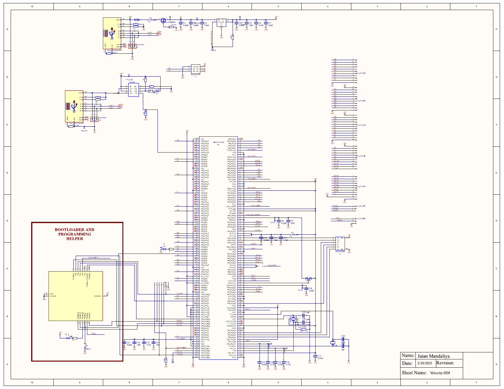
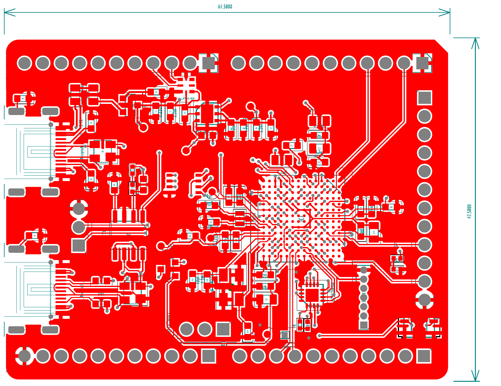
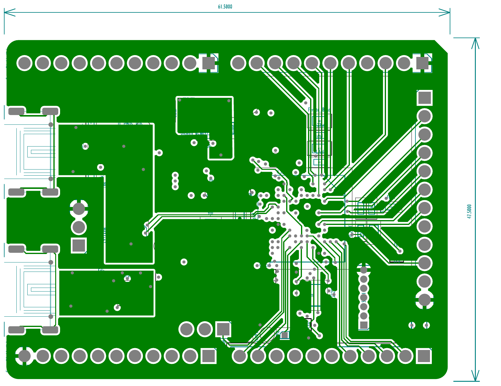
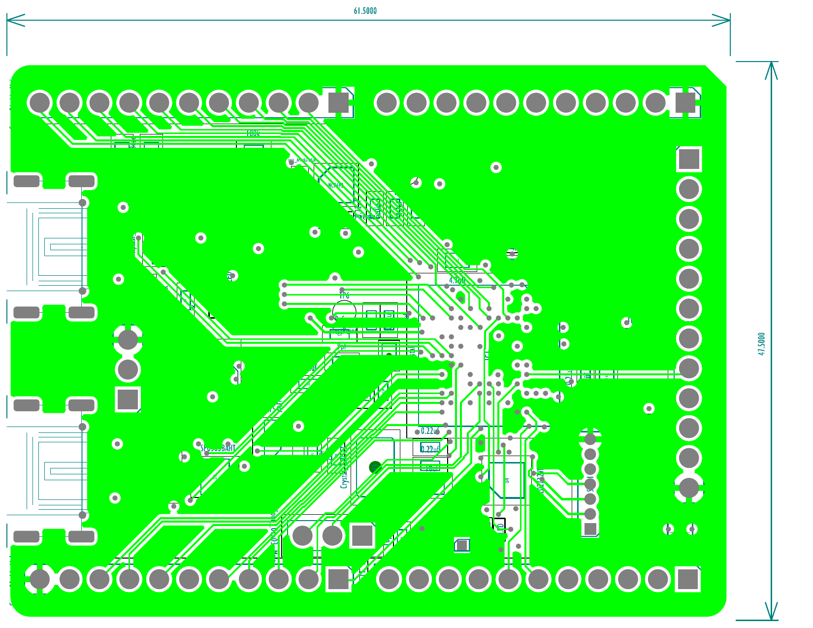
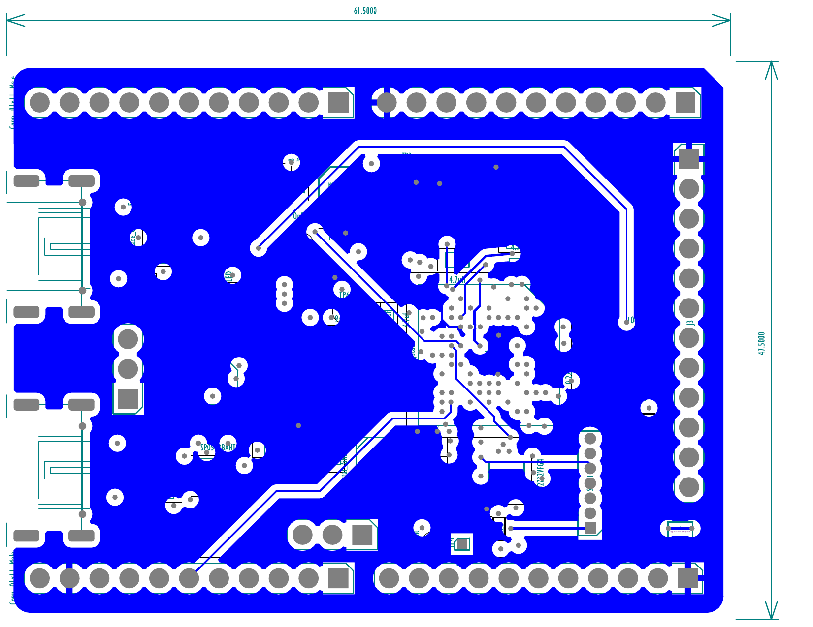
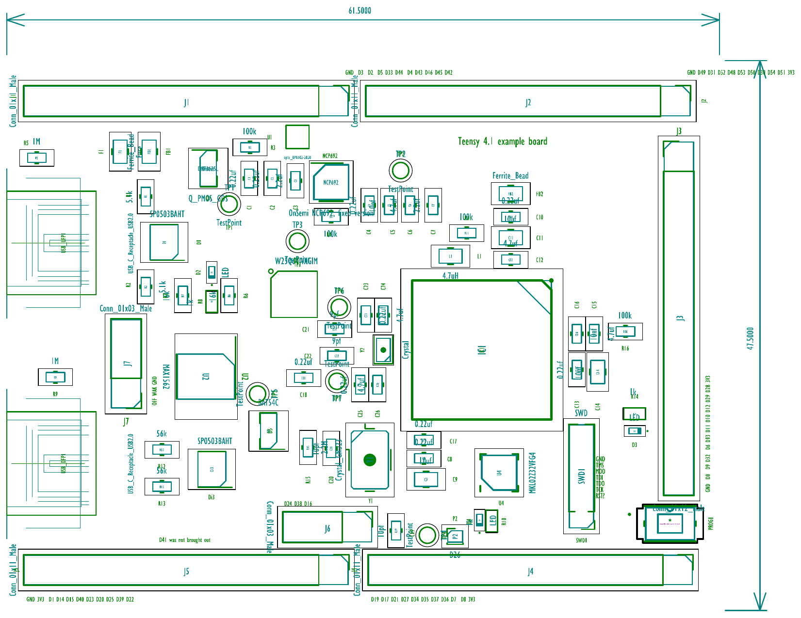

# Velocity-HDI

A 4-layer High Density Interconnect (HDI) PCB designed around the **Teensy 4.1** microcontroller. The board provides a compact, high-performance carrier with breakout access to all Teensy 4.1 I/O, onboard power regulation, USB connectivity, and a dedicated bootloader/programming interface.

**Author:** Jatan Mandaliya

---

## Schematic

The schematic covers the full circuit: microcontroller core, power supply network, USB interface, and the bootloader/programming section.



---

## PCB Layer Stack

The board uses a 4-layer stackup. The artwork prints below show each conductive layer in isolation.

### Top Copper (Signal Top)

The primary routing layer. Contains the densest signal traces, component pads, and most of the high-speed net routing from the Teensy 4.1.



### Inner Layer 1 (Signal 1)

First internal routing layer, used for additional signal routing and power distribution planes.



### Inner Layer 2 (Signal 2)

Second internal routing layer, providing further signal routing and reference plane support for impedance-controlled traces.



### Bottom Copper (Signal Bot)

The rear routing layer, carrying remaining signal traces and additional power/ground fills.



### Assembly Drawing

Component placement view showing all reference designators and part outlines for board assembly.



---

## Repository Structure

```
Velocity-HDI/
├── Design/
│   ├── Schematic.pdf          # Full circuit schematic (1 page)
│   └── PCB_Layout.pdf         # Final artwork prints for all 19 layers
│
├── Manufacturing/
│   ├── Assembly/
│   │   └── Assembly Drawings.pdf   # Component placement and assembly notes
│   └── Fabrication/
│       ├── *.gbr                   # Gerber files for all layers
│       ├── drill.pdf               # Drill drawing
│       ├── drill guide.pdf         # Drill guide
│       ├── CAMtastic2.Cam          # CAM job file
│       └── Teensy4.1-example.*     # Layer-specific Gerber outputs
│
└── images/                    # Extracted layer preview images
```

---

## Fabrication Files

The `Manufacturing/Fabrication/` folder contains the complete Gerber package ready for PCB fabrication.

| File | Layer |
|------|-------|
| `Teensy4.1-example_Copper_Signal_Top.gbr` | Top copper |
| `Teensy4.1-example_Copper_Signal_1.gbr` | Inner copper 1 |
| `Teensy4.1-example_Copper_Signal_2.gbr` | Inner copper 2 |
| `Teensy4.1-example_Copper_Signal_Bot.gbr` | Bottom copper |
| `Teensy4.1-example_Soldermask_Top.gbr` | Top soldermask |
| `Teensy4.1-example_Soldermask_Bot.gbr` | Bottom soldermask |
| `Teensy4.1-example_Paste_Top.gbr` | Top solder paste |
| `Teensy4.1-example_Paste_Bot.gbr` | Bottom solder paste |
| `Teensy4.1-example_Legend_Top.gbr` | Top silkscreen |
| `Teensy4.1-example_Legend_Bot.gbr` | Bottom silkscreen |
| `Teensy4.1-example_Profile.gbr` | Board outline |
| `Teensy4.1-example_PTH_Drill.gbr` | Plated through-hole drill |
| `Teensy4.1-example_NPTH_Drill.gbr` | Non-plated through-hole drill |
